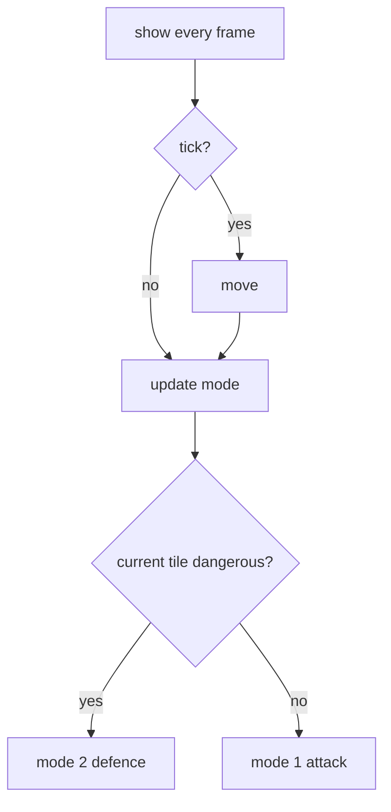

# AI (`PlayerIA`)

Implemented in [IA_Boi.pde](../IA_Boi.pde) with the graph helpers in
[PathFinding_Stuff.pde](../PathFinding_Stuff.pde). The AI controls **Player 2** when `IAPlaying` is true
(menu entry `1 Vs IA`, name forced to `IA`, helmet colour black).

## Path finding

- At `setup()` a `Graph` is built from `map`: one node per non-wall cell (node id = `delta * row + delta + col`
  with `delta = 14`), with 4-neighbour edges.
- Edge cost is 5, or 1 when the cell holds a visible power-up (the code that should give dirt a cost of 10
  is overwritten by the `else`, see [limitations.md](limitations.md)).
- `GraphSearch_Astar` with the `AshCrowFlight(3)` heuristic from the *Pathfinder* library computes the route.
  `rNodes` holds the route, `exploredEdges` the examined edges (for debugging).
- The graph is **not rebuilt** when blocks are destroyed: dirt is handled by blowing it up, not by routing.

## Decision loop

`PlayerIA.show()` is called every frame while the game runs and is not paused.

1. Read the next step of the current route (`rNodes[1]`) and the current tile.
2. Act only once every few frames (counter `c`: 5 initially, then 3), i.e. about 7 actions per second.
3. Pick a mode from the danger flags of the current tile:
   - mode 1 (**attack**): the tile is not dangerous
   - mode 2 (**defence**): the tile is `dangerous` (explosion, skull, bomb or announced danger)

### Mode 1: attack

Route from the AI to Player 1, then look at the next tile:

| Next tile | Action |
|---|---|
| dirt, death skull, or occupied by Player 1 | place a bomb |
| `safe` | step toward it |
| burning or about to burn | `findPUp()`: step onto a neighbouring safe power-up if one exists, otherwise wait |

### Mode 2: defence

`searchSafePlace()` runs a breadth-first search (up to 10 expansion levels) over cells that are not burning, not
a skull, bomb, wall, dirt or the human player, until it finds a `safe` cell. It then asks A* for a route to it
and the AI steps along the route unless the next tile is a skull.

## Strengths and weaknesses

- Reasonably good at escaping its own bombs and picking nearby power-ups.
- Never evaluates whether its bomb has an escape route before placing it, never avoids dead ends, never
  collects power-ups on purpose, and has no concept of difficulty other than the shared bomb fuse.
- Its speed is fixed and not related to the difficulty slider.
- Uses the global names `Player1`, `Player2`, `startNode`, `endNode`; it cannot control another player without
  changes.
