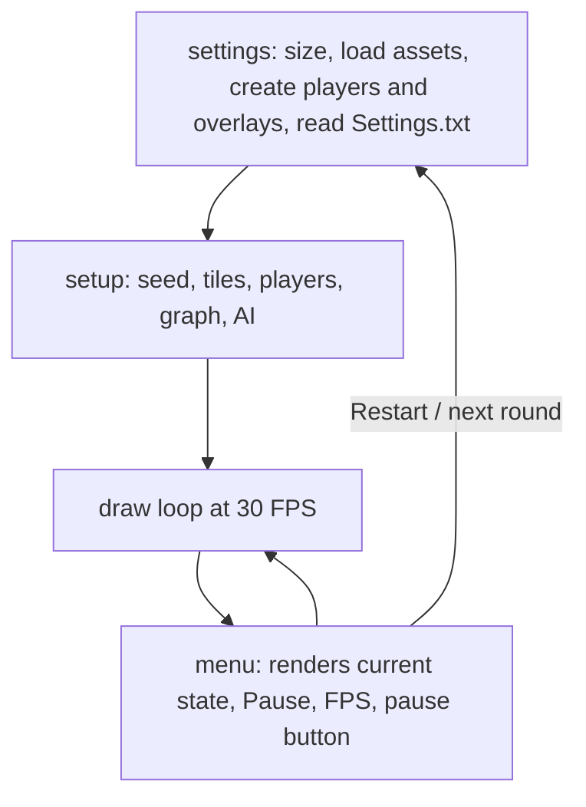
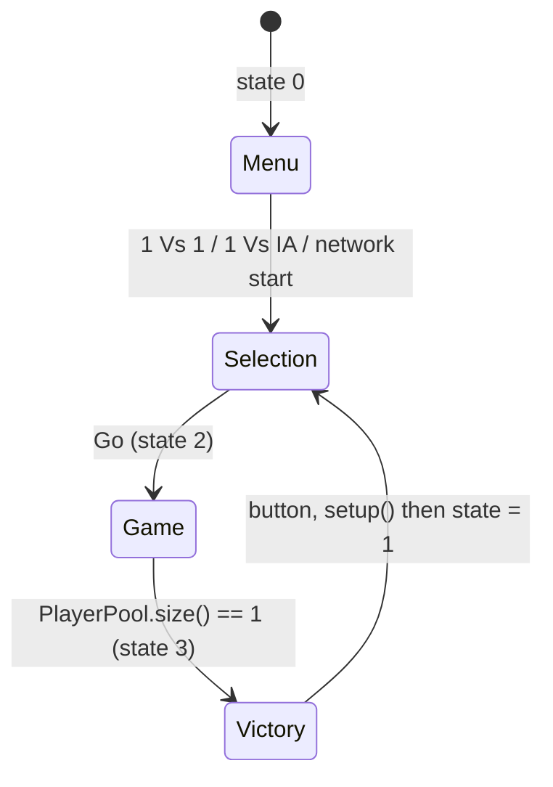

# Architecture (technical documentation)

## Technology

- Processing 4 (Java mode). The `.pde` tabs are concatenated by the preprocessor into a single class that
  extends `PApplet`, so all top-level variables and functions are effectively globals of one class.
- Libraries: `processing.sound` (audio), `processing.net` (TCP, built in), `pathfinder` (Peter Lager's
  *Pathfinder* library: graph + A*).
- Rendering is 2D (`size(590, 420)`), HSB colour mode (`colorMode(HSB)`), 30 FPS.

## Source map

| File | Role |
|---|---|
| [BomberGame.pde](../BomberGame.pde) | Imports, globals, level `map`, `settings()`, `setup()`, `draw()`, `MsConversion()` |
| [GuideLine.pde](../GuideLine.pde) | `menu()`: the screen state machine plus the pause button and FPS counter |
| [Player.pde](../Player.pde) | `Player`: position, movement, collisions, bombs, power-up pick-up, death, helmet drawing |
| [Bomb.pde](../Bomb.pde) | `Bomb`: fuse, blast propagation, danger map |
| [Tile.pde](../Tile.pde) | `Tile`: per-cell flags (wall, dirt, explosion parts, power-ups), rendering, random generation |
| [Overlay.pde](../Overlay.pde) | `Overlay`: side panel of each player |
| [IA_Boi.pde](../IA_Boi.pde) | `PlayerIA`: computer opponent |
| [PathFinding_Stuff.pde](../PathFinding_Stuff.pde) | Graph creation, A* set-up, debug drawing helpers |
| [Network.pde](../Network.pde) | Host / join UI, `decrypt()` message handler, connection events |
| [Mooving.pde](../Mooving.pde) | `keyPressed()`, `mousePressed()`, `IsPressed()` hit-test helper |
| [Menu_Pause.pde](../Menu_Pause.pde) | `Pause()`: pause overlay with options, difficulty slider, restart |
| [TextInput_and_DrawSlider.pde](../TextInput_and_DrawSlider.pde) | `TextInput` widget and `drawSlider()` hue slider |
| [Init_Images_and_savePara.pde](../Init_Images_and_savePara.pde) | `initImg()` asset loading, `savePara()`, `playing()` |

## Life cycle

- `settings()` is used instead of the usual `size()` in `setup()` because assets and parameters are loaded
  before the first frame. It is called again on Restart (assets are reloaded each time).
- `setup()` is called explicitly again to start a new round (victory screen button, restart, network start).
  It clears `TilePool` / `PlayerPool`, reseeds the RNG, rebuilds the 13x13 `tiles`, regenerates dirt and
  power-ups, positions players, builds the AI graph and creates the `PlayerIA`.
- `draw()` clears the canvas, translates the origin by (100, 30) so the board starts at (0, 0), updates `temp`
  (game clock in ms, frozen while paused using `timePaused`), calls `menu()`, and handles music
  (starts a random track when none is playing and `music` is on).
- Mouse coordinates are converted with `MouseX = mouseX - 100`, `MouseY = mouseY - 30`.

## State machine (`state`)

| `state` | Rendered by | Notes |
|---|---|---|
| 0 | `menu()` case 0 + `network_Waiting()` | Buttons are hit-tested with `IsPressed(x1, x2, y1, y2)` in board coordinates |
| 1 | `menu()` case 1 | Colour sliders, ready indicator (network), Go button |
| 2 | `menu()` case 2 | Tiles drawn first, then players; dead players removed in local mode; AI updated |
| 3 | `menu()` case 3 | Winner is `PlayerPool.get(0)` |

Global flags worth knowing: `paused`, `IAPlaying`, `networkON` / `waitingServer` / `waitingClient`,
`clientReady`.

## Data model

### The grid

- `map[row][col]`: static template: `0` ground, `2` wall, `3` ground that must stay clear (spawn areas).
- `tiles[row][col]` (`Tile`): dynamic state. It holds boolean flags rather than an enum, so several flags can
  be true at once (for example `dirt` plus a hidden `bombeup`).
- Coordinate conventions are easy to mix up:
  - `tiles[j][i]` is `[row][column]`, i.e. `[y][x]`.
  - `Player.getPosition()` returns `{row, col}`.
  - `Bomb.pos` is a `PVector(col, row)`, built from `int[]{row, col}`.
  - `PlayerIA.currentTile` / `nextTile` are `{col, row}` (inverse of `getPosition()`).

### Tile flags

| Group | Flags |
|---|---|
| Terrain | `wall`, `dirt`, `grass`, `clear` (never gets dirt) |
| Bomb | `bomb` |
| Explosion drawing | `expCentre`, `expHaut`, `expBas`, `expGauche`, `expDroite`, `vertical`, `horizontal`, and the aggregate `expl` |
| Power-ups | `flame`, `bombeup`, `invincibility`, `bombfeet`, `death` |
| AI helpers | `dangerous` (explosion, skull, bomb or announced danger), `onGoingDanger` (will burn soon), `safe` (ground or power-up, not dangerous) |
| Misc | `PUpOff` (lets a blast destroy a visible power-up) |

### Players

`Player` holds: `pos` (pixels), `flame` (1-3), `nbBomb`, `bomb` (list of active bombs), timers `nbInv` / `nbFeet`
(frames), `dead`, `score`, `Color` (hue), `name`. `PlayerPool` contains the players still alive; `Player1` and
`Player2` are the permanent references. The score lives in the `Player` objects and survives `setup()`
because `init()` does not reset it.

## Core algorithms

### Movement and collisions

`Player.move(dep)` tests the destination tile (`PixelToCase()`): blocked by walls, dirt, bombs (unless
`feetBomb`) and the other player. Movement is discrete: a full tile of 30 px per key press. Positions are
stored as the top-left of the sprite, the tile centre is `pos + 15`.

### Bomb life cycle (`Bomb.explosion()`, called every frame by `Player.bomb()`)

1. `generateDanger()` flags tiles that will burn (`onGoingDanger`), used by the AI.
2. If the bomb's own tile is already burning (chain reaction), the fuse is forced to expire immediately.
3. When `temp >= time + timeToExplosion`, the bomb tile is freed, `Sexpl` plays once and `drawexplosion()` runs.
4. `drawexplosion()` walks the four directions up to `flame` tiles; it stops at walls, passes through dirt,
   marks segment tiles (`vertical` / `horizontal`) and tip tiles (`expHaut`...), then marks the centre.
   Burnt tiles are recorded in `TileExp`.
5. 500 ms later the recorded tiles are reset and the bomb is flagged `off` and removed from the owner.

The same direction-walking logic is duplicated four times in both `generateDanger()` and `drawexplosion()`.

### Death

`Player.IsDead()` marks the player dead when its tile has `death`, `wall` or `expl`, unless invincible.
In local mode `menu()` removes the dead player from `PlayerPool`; in network mode removal is negotiated with
message `15` (see [network-protocol.md](network-protocol.md)).

### Timing

- `temp` is the game clock in ms. While paused, `timePaused = millis() - temp` is refreshed so that the clock
  continues from the same value on resume.
- Bomb fuse and explosion duration use `temp` (ms); power-up durations use frame counters (300 frames).

### Random generation and determinism

`setup()` draws `SeedUsed = floor(random(1e9))` (offline or host) then calls `randomSeed(SeedUsed)`;
a client receives the seed with message `14`. Both machines therefore build the same map.

### UI helpers

- `TextInput`: minimal text field (click to select, backspace, space, printable characters 32-122).
- `drawSlider()`: rainbow hue slider returning the selected hue.
- `Overlay`: draws a panel and keeps `Player.name` synchronised with its text field.

## Dependencies on global state

Nearly every class reads globals (`tiles`, `PlayerPool`, `temp`, `difficulty`, `sounds`, images).
There is no unit-testable logic apart from small pure helpers (`MsConversion`, `Tile.rank`, ...).
A refactor path is proposed in [limitations.md](limitations.md#ideas-for-improvement).
