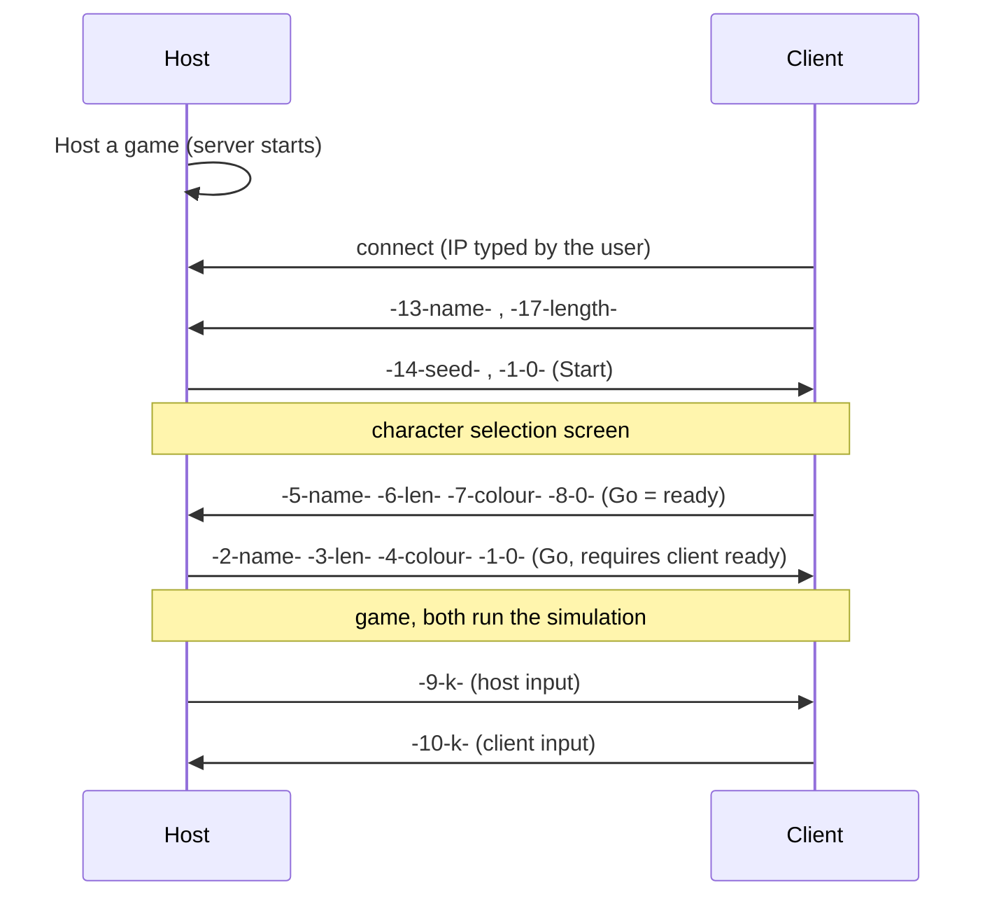

# Network protocol

Network play uses the Processing `net` library over **TCP, port 5204**. There is no central authority:
both machines run the full simulation and exchange **inputs and UI events**; determinism comes from a shared
random seed.

| Role | Plays | Created with |
|---|---|---|
| Host (`waitingServer`) | Player 1 (`Z Q S D` + `Space`) | `new Server(this, 5204)` |
| Client (`waitingClient`) | Player 2 (arrows + `0`) | `new Client(this, ip, 5204)` |

The host IP shown on screen comes from `Server.ip()`.

## Connection flow



## Message format

```
-<code>-<value>-
```

- Several messages may be concatenated in a single string. `decrypt()` splits the string on `-` and
  consumes tokens **three by three** (empty token, code, value).
- Values are ASCII. Because `-` is the separator, **names or values containing `-` break parsing**.
- Direction codes for inputs: `1` right, `2` left, `3` up, `4` down, `5` place a bomb.

## Message catalogue

| Code | Sent by | Value | Effect on the receiver |
|---|---|---|---|
| 1 | Host | `0` | `state++`: start (selection screen, then game) |
| 2 | Host | name | Sets player 1 name |
| 3 | Host | length | Sets player 1 name length |
| 4 | Host | hue | Sets player 1 colour |
| 5 | Client | name | Sets player 2 name |
| 6 | Client | length | Sets player 2 name length |
| 7 | Client | hue | Sets player 2 colour |
| 8 | Client | `0` | Toggles `clientReady` |
| 9 | Host | direction | Moves / bombs for **Player 1** on the receiver |
| 10 | Client | direction | Moves / bombs for **Player 2** on the receiver |
| 11 | Host | ms | Sets difficulty and slider position |
| 12 | Both | `0` | Toggles pause |
| 13 | Client | name | Host stores `clientName`, shows "has connected" and uses it as player 2 name |
| 14 | Host | seed | Sets `SeedUsed` (applied by the next `setup()`) |
| 15 | Both | player index | If that player is dead locally, removes it from `PlayerPool` and echoes the message |
| 17 | Client | length | Sets player 2 name length |

Code `16` is unused.

## Disconnection

`disconnectEvent()` clears the client name; if a game was running it calls `settings()` + `setup()` and
resets network flags, returning the game to its initial state.

## Security and robustness notes

- No authentication, no encryption, no validation of values (`int()` of an invalid string yields 0).
- Any peer reaching port 5204 can send inputs: use it only on trusted networks.
- Inputs are applied locally by the sender and replayed remotely, without acknowledgement or reconciliation.
  Latency or packet differences can desynchronise both simulations (see [limitations.md](limitations.md)).
- The host receives data through `Server.available()`; the corresponding code path lives in
  `network_Waiting()` ([Network.pde](../Network.pde)) and is the first place to check when debugging
  host-side reception.
